# CEDA: Canny Edge Detection Accelerator

A real-time edge detection accelerator implementing the Canny algorithm, optimized for streaming video processing on FPGA.

**Target Platform:** Arty Z7-20 (Xilinx Zynq XC7Z020)

## Table of Contents

1. [Overview](#1-overview)
2. [System Architecture](#2-system-architecture)
3. [Gaussian Filter Stage](#3-gaussian-filter-stage)
4. [Sobel Gradient Stage](#4-sobel-gradient-stage)
5. [Non-Maximum Suppression (NMS) Stage](#5-non-maximum-suppression-nms-stage)
6. [Thresholding Stage](#6-thresholding-stage)
7. [Line Buffer Architecture](#7-line-buffer-architecture)
8. [Resource Utilization Estimates](#8-resource-utilization-estimates)
9. [Experimental Filter Outputs](#9-experimental-filter-outputs)
10. [References](#10-references)

## Directory Structure

```text
ceda/
├── docs/                   # Architecture specs, diagrams, datasheets
│   └── images/
├── hw/                     # Hardware Source (The "IP")
│   ├── rtl/                # Synthesizable Verilog
│   │   ├── inc/            # Include files (parameters, defines)
│   │   ├── gaussian/       # Gaussian filter submodules
│   │   ├── sobel/          # Sobel gradient submodules
│   │   ├── nms/            # Non-maximum suppression submodules
│   │   ├── common/         # Shared components (line buffers, etc.)
│   │   └── ceda_top.v      # Top-level wrapper
│   └── ip/                 # Xilinx generated IPs
├── dv/                     # Design Verification (Simulation)
│   └── cocotb/             # Python-based testbenches
│       ├── tests/          # Test cases per module
│       ├── models/         # Python golden models (OpenCV reference)
│       └── Makefile
├── sw/                     # Software (runs on ARM Cortex-A9)
│   ├── driver/             # C drivers (register maps, DMA handling)
│   └── apps/               # Demo applications
├── fpga/                   # Vivado Implementation specific files
│   ├── constraints/        # .xdc files (pinout, timing)
│   ├── scripts/            # TCL scripts to recreate the project
│   └── vivado_project/     # (Git ignore this) The actual build directory
└── Makefile                # Top-level makefile to drive the flow
```

## 1. Overview

This project implements a fully pipelined Canny edge detection accelerator optimized for real-time video processing. The design processes 1080p video at 30+ fps using a streaming architecture with AXI-Stream interfaces.

### Design Philosophy

The Canny edge detection algorithm consists of four stages, each mapped to dedicated hardware:

1. **Gaussian Smoothing** — Noise reduction using 5×5 convolution
2. **Gradient Computation** — Sobel operators for edge strength and direction
3. **Non-Maximum Suppression** — Edge thinning along gradient direction
4. **Thresholding** — Binary edge classification

### Key Parameters

| Parameter              | Value                 |
| ---------------------- | --------------------- |
| Target Resolution      | 1920 × 1080 (Full HD) |
| Target Frame Rate      | 30 fps (62.2 Mpx/s)   |
| Throughput             | 1 pixel/cycle         |
| Input Precision        | 8-bit grayscale       |
| Intermediate Precision | 32-bit integer        |
| Output Format          | 1-bit binary edge map |
| Interface              | AXI4-Stream           |

### Performance Analysis

At 100 MHz clock frequency:

- **Throughput:** 100 Mpx/s (1 pixel/cycle)
- **Frame time (1080p):** 20.7 ms
- **Achievable frame rate:** ~48 fps

> [!NOTE]
> The design exceeds the 30 fps target, providing margin for blanking intervals (VBLANK/HBLANK) and system overhead.

## 2. System Architecture

The system implements a **fully pipelined streaming architecture** where each stage processes one pixel per clock cycle.

Simplified Dataflow diagram:

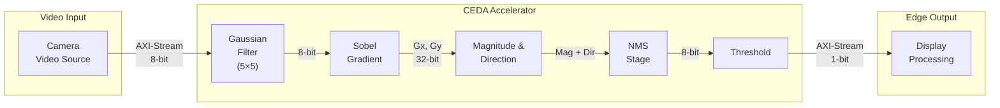

Full diagram:

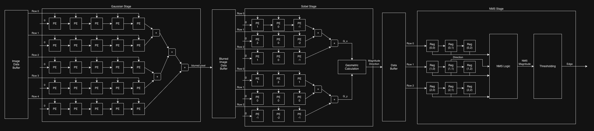

### Pipeline Timing

The following diagram shows how stages overlap in time. Each stage starts as soon as it has enough buffered data (line buffers filled):

```mermaid
%%{init: {
  'gantt': {'leftPadding': 100},
  'themeVariables': {
    'taskTextDarkColor': '#000000ff'
  }
}}%%

gantt
    dateFormat X
    axisFormat %s

    %% Line width = 1920 pixels
    %% 1 Line = 1920
    %% 2 Lines = 3840
    %% 3 Lines = 5760
    %% 4 Lines = 7680

    section Gaussian
    Running (Starts @ 0)         :active, g, 0, 9600

    section Sobel
    Wait (2 Lines)               :done, s_wait, 0, 3840
    Running (Starts @ 3840)      :active, s, after s_wait, 9600

    section NMS
    Wait (3 Lines)               :done, n_wait, 0, 5760
    Running (Starts @ 5760)      :active, n, after n_wait, 9600

    section Threshold
    Wait (4 Lines)               :done, t_wait, 0, 7680
    Running (Starts @ 7680)      :active, t, after t_wait, 9600
```

> [!NOTE]
> At steady state, **all stages process simultaneously** — each working on a different pixel from a different row. The pipeline latency (~4 lines) only affects the first output; thereafter, one edge pixel is produced per clock cycle.

### Pipeline Stages Summary

| Stage     | Function                   | Input       | Output                    | Latency     |
| --------- | -------------------------- | ----------- | ------------------------- | ----------- |
| Gaussian  | 5×5 noise reduction        | 8-bit pixel | 8-bit smoothed            | 2 lines + 5 |
| Sobel     | 3×3 gradient computation   | 8-bit pixel | 32-bit Gx, Gy             | 1 line + 3  |
| Magnitude | Edge strength & direction  | Gx, Gy      | Mag (12-bit), Dir (3-bit) | 1 cycle     |
| NMS       | Non-maximum suppression    | Mag + Dir   | 8-bit thinned             | 1 line + 3  |
| Threshold | Binary edge classification | 8-bit       | 1-bit edge                | 1 cycle     |

**Total Pipeline Latency:** ~4 lines + 12 cycles (~4 lines for 1080p)

### AXI-Stream Interface

| Signal     | Width | Direction | Description           |
| ---------- | ----- | --------- | --------------------- |
| `s_tdata`  | 8     | Input     | Grayscale pixel value |
| `s_tvalid` | 1     | Input     | Data valid signal     |
| `s_tready` | 1     | Output    | Ready to accept data  |
| `s_tlast`  | 1     | Input     | End of line marker    |
| `s_tuser`  | 1     | Input     | Start of frame marker |
| `m_tdata`  | 1     | Output    | Binary edge pixel     |
| `m_tvalid` | 1     | Output    | Output valid signal   |
| `m_tready` | 1     | Input     | Downstream ready      |
| `m_tlast`  | 1     | Output    | End of line marker    |
| `m_tuser`  | 1     | Output    | Start of frame marker |

### Clock Domain

| Domain    | Frequency | Source    | Usage                   |
| --------- | --------- | --------- | ----------------------- |
| Pixel Clk | 100 MHz   | FCLK_CLK0 | All CEDA datapath logic |
| AXI Clock | 100 MHz   | FCLK_CLK0 | AXI interconnect        |

### Boundary Handling (Replicate Border)

When convolution windows extend beyond frame boundaries, pixel values are **replicated** from the nearest valid pixel.

#### Horizontal Replication (Left Edge Example)

When the 5×5 window is centered at column 1, columns -1 and 0 are outside the frame:

| Col -2 | Col -1 | Col 0 | Col 1 | Col 2 |
| :----: | :----: | :---: | :---: | :---: |
|   A    |   A    |   A   |   B   |   C   |

Column 0 value (`A`) is replicated for out-of-bounds positions.

#### Vertical Replication (Top Edge Example)

When the 5×5 window is centered at row 1, rows -1 and 0 are outside the frame:

| Row | Pixel Value |
| :-: | :---------: |
| -2  |      P      |
| -1  |      P      |
|  0  |      P      |
|  1  |      Q      |
|  2  |      R      |

Row 0 value (`P`) is replicated for out-of-bounds positions.

#### Corner Case (Top-Left)

At pixel (0, 0), both horizontal and vertical replication apply:

|        | Col -2 | Col -1 | Col 0 | Col 1 | Col 2 |
| :----: | :----: | :----: | :---: | :---: | :---: |
| Row -2 |   A    |   A    |   A   |   B   |   C   |
| Row -1 |   A    |   A    |   A   |   B   |   C   |
| Row 0  |   A    |   A    |   A   |   B   |   C   |
| Row 1  |   D    |   D    |   D   |   E   |   F   |
| Row 2  |   G    |   G    |   G   |   H   |   I   |

#### Replication Rules Summary

| Boundary    | Condition | Replication Rule           |
| ----------- | --------- | -------------------------- |
| Left edge   | x < 2     | `pixel[0, y]` replicated   |
| Right edge  | x > W-3   | `pixel[W-1, y]` replicated |
| Top edge    | y < 2     | `pixel[x, 0]` replicated   |
| Bottom edge | y > H-3   | `pixel[x, H-1]` replicated |

> [!IMPORTANT]
> Output frame size remains **1920×1080** — identical to input. No cropping occurs.

**Implementation:** Line buffers are initialized with the first valid pixel of each line during the fill phase. Horizontal replication is handled by holding the shift register output at boundaries.

### Control Signal Propagation

The `TUSER` (Start of Frame) and `TLAST` (End of Line) signals are delayed to align with the processed data:

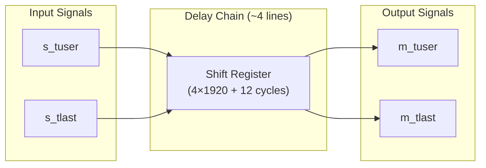

| Signal     | Delay               | Notes                                  |
| ---------- | ------------------- | -------------------------------------- |
| `m_tuser`  | 4 lines + 12 cycles | Aligns with first valid edge pixel     |
| `m_tlast`  | 4 lines + 12 cycles | Marks end of corresponding output line |
| `m_tvalid` | 4 lines + 12 cycles | Follows input `s_tvalid` pattern       |

> [!NOTE]
> The delay matches the total pipeline latency, ensuring downstream blocks receive a well-formed AXI-Stream with correctly aligned control signals.

### Backpressure Logic (Global Stall)

When the downstream block deasserts `m_tready`, the **entire pipeline freezes**:

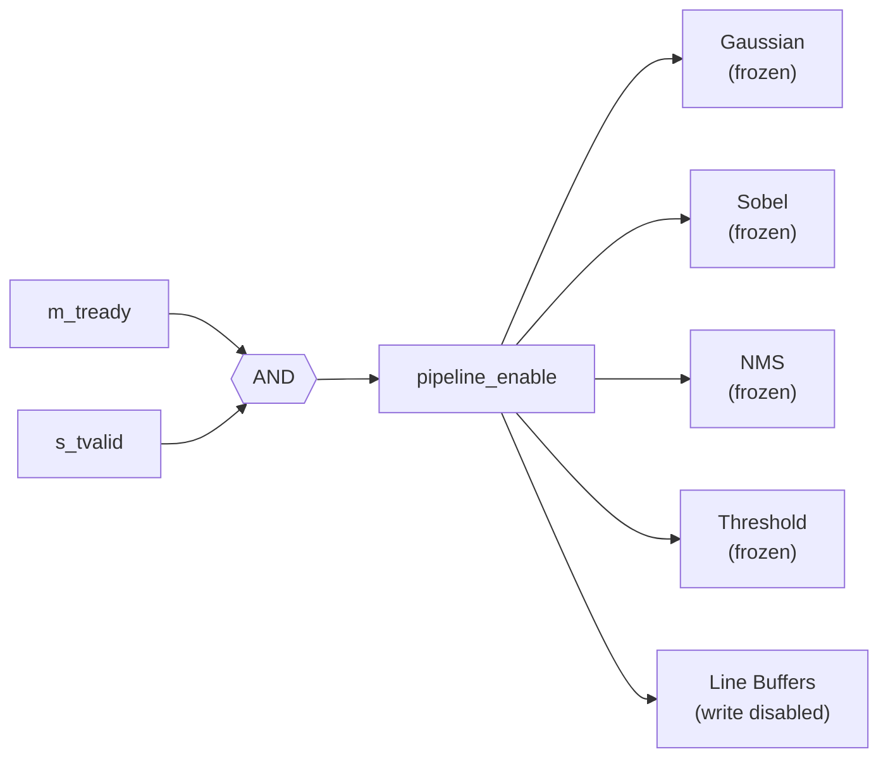

**Critical rule:** When `pipeline_enable = 0`:

- All registers hold their current values
- Line buffer write pointers **do not increment**
- No data is consumed from the input (`s_tready` goes low)

```verilog
// Global stall logic
wire pipeline_enable = m_tready & s_tvalid;
assign s_tready = m_tready;  // Propagate backpressure upstream

always @(posedge clk) begin
    if (pipeline_enable) begin
        // Normal pipeline operation
        stage1_reg <= stage0_out;
        stage2_reg <= stage1_out;
        // ... etc
    end
    // else: all registers hold (implicit in Verilog)
end
```

> [!CAUTION]
> A common bug is pausing compute logic while line buffers continue writing. This corrupts row alignment and produces garbage output. Always gate line buffer writes with `pipeline_enable`.

### Valid Signal Propagation

The `valid` signal ripples through the pipeline in a "staircase" pattern during startup:

```mermaid
%%{init: {
  'gantt': {'leftPadding': 100},
  'themeVariables': {
    'taskTextDarkColor': '#000000ff'
  }
}}%%

gantt
    dateFormat X
    axisFormat %s

    section s_tvalid (Input)
    Active                          :active, sv, 0, 9600

    section Gaussian valid
    Filling (2 lines)               :done, gf, 0, 3840
    Valid output                    :active, after gf, 9600

    section Sobel valid
    Waiting                         :done, sw, 0, 3840
    Filling (1 line)                :done, after sw, 5760
    Valid output                    :active, after sf, 9600

    section NMS valid
    Waiting                         :done, nw, 0, 5760
    Filling (1 line)                :done, fill, after nw, 7680
    Valid output                    :active, after fill, 9600

    section m_tvalid
    Waiting (4 lines)               :done, tw, 0, 7680
    Valid output                    :active, after tw, 9600
```

At steady state (after ~4 lines), all stages produce valid output every cycle.

## 3. Gaussian Filter Stage

The Gaussian filter performs noise reduction using a 5×5 convolution, essential for robust edge detection in noisy video streams.

### Architecture

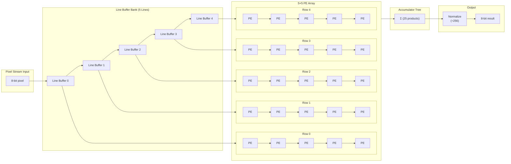

### Specifications

| Parameter             | Value              | Notes                             |
| --------------------- | ------------------ | --------------------------------- |
| Kernel Size           | 5 × 5              | Standard Gaussian for edge detect |
| PEs                   | 25                 | Fully parallel convolution        |
| Line Buffers          | 4 (of 1920 pixels) | BRAM-based shift registers        |
| Input Precision       | 8-bit unsigned     | Grayscale pixel                   |
| Coefficient Precision | 8-bit unsigned     | Power-of-2 friendly kernel        |
| Accumulator Width     | 24-bit             | Prevents overflow (8+8+log2(25))  |
| Output Precision      | 8-bit unsigned     | Normalized result                 |

### Gaussian Kernel

The 5×5 Gaussian kernel with σ ≈ 1.0, scaled for integer arithmetic (sum = 256):

```math
\begin{bmatrix}
1 & 4 & 6 & 4 & 1 \\
4 & 16 & 24 & 16 & 4 \\
6 & 24 & 36 & 24 & 6 \\
4 & 16 & 24 & 16 & 4 \\
1 & 4 & 6 & 4 & 1
\end{bmatrix}
\quad \text{sum} = 256 \; (\text{divide by } 2^8)
```

### Processing Element (PE) Structure

Each PE performs a single multiply operation:

```text
product = pixel × coefficient
```

The 25 products are summed in an adder tree and normalized by right-shifting 8 bits.

## 4. Sobel Gradient Stage

The Sobel stage computes horizontal (Gx) and vertical (Gy) gradients using 3×3 convolution kernels, enabling edge strength and direction extraction.

### Architecture

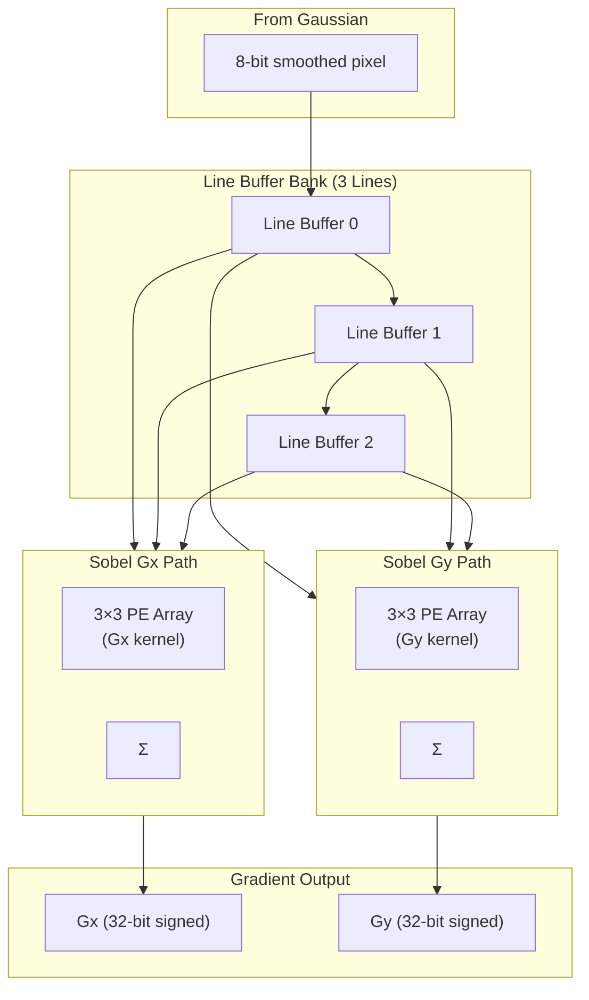

### Specifications

| Parameter      | Value          | Notes                    |
| -------------- | -------------- | ------------------------ |
| Kernel Size    | 3 × 3          | Standard Sobel operators |
| Parallel Paths | 2 (Gx, Gy)     | Computed simultaneously  |
| Line Buffers   | 2 (of 1920 px) | Shared between Gx and Gy |
| Output Range   | -1020 to +1020 | 4× input range (signed)  |
| Output Width   | 32-bit signed  | Matches system precision |

### Sobel Kernels

**Horizontal Gradient (Gx):**

```math
\begin{bmatrix}
-1 & 0 & 1 \\
 -2 &  0 &  2 \\
 -1 &  0 &  1
\end{bmatrix}
```

**Vertical Gradient (Gy):**

```math
\begin{bmatrix}
-1 & -2 &  1 \\
 0 &  0 &  0 \\
 1 &  2 &  1
\end{bmatrix}
```

### Magnitude Calculation

Edge magnitude uses the **Manhattan distance approximation** for hardware efficiency:

Magnitude = $|G_x| + |G_y|$

| Approach  | Formula                                 | Operations                   | Accuracy |
| --------- | --------------------------------------- | ---------------------------- | -------- |
| Manhattan | $\lvert G_x \rvert + \lvert G_y \rvert$ | 2 abs + 1 add                | ~85%     |
| Euclidean | $\sqrt{Gx^2 + Gy^2}$                    | 2 mul + 1 add + $\sqrt{...}$ | 100%     |

> [!NOTE]
> Manhattan distance is sufficient for blob tracking applications and eliminates the need for multipliers and square root logic.

### Direction Calculation

Gradient direction is quantized to 8 directions ($0^\circ$, $22.5^\circ$, $45^\circ$, ..., $157.5^\circ$) using a **comparison-based approach** that avoids expensive $\arctan$ computation:

$\theta = f\left( \frac{\lvert G_y \rvert}{\lvert G_x \rvert}, \text{sign}(G_x), \text{sign}(G_y) \right)$

| **Direction Bin**     | **Angle Range**                                | **Condition**                                                                                               |
| --------------------- | ---------------------------------------------- | ----------------------------------------------------------------------------------------------------------- |
| **0** $(\rightarrow)$ | $-22.5^\circ \leq \text{dir} \leq 22.5^\circ$  | $G_x > 0$, $\lvert G_y \rvert \leq 0.414 \times \lvert G_x \rvert$                                          |
| **1** $(\nearrow)$    | $22.5^\circ < \text{dir} < 67.5^\circ$         | $G_x > 0$, $G_y > 0$, $0.414 \times \lvert G_x \rvert < \lvert G_y \rvert < 2.414 \times \lvert G_x \rvert$ |
| **2** $(\uparrow)$    | $67.5^\circ \leq \text{dir} \leq 112.5^\circ$  | $G_y > 0$, $G_y \geq 2.414 \times \lvert G_x \rvert$                                                        |
| **3** $(\nwarrow)$    | $112.5^\circ < \text{dir} < 157.5^\circ$       | $G_x < 0$, $G_y > 0$, $0.414 \times \lvert G_x \rvert < \lvert G_y \rvert < 2.414 \times \lvert G_x \rvert$ |
| **4** $(\leftarrow)$  | $157.5^\circ \leq \text{dir} \leq 202.5^\circ$ | $G_x < 0$, $\lvert G_y \rvert \leq 0.414 \times \lvert G_x \rvert$                                          |
| **5** $(\swarrow)$    | $202.5^\circ < \text{dir} < 247.5^\circ$       | $G_x < 0$, $G_y < 0$, $0.414 \times \lvert G_x \rvert < \lvert G_y \rvert < 2.414 \times \lvert G_x \rvert$ |
| **6** $(\downarrow)$  | $247.5^\circ \leq \text{dir} \leq 292.5^\circ$ | $G_y < 0$, $\lvert G_y \rvert \geq 2.414 \times \lvert G_x \rvert$                                          |
| **7** $(\searrow)$    | $292.5^\circ < \text{dir} < 337.5^\circ$       | $G_y < 0$, $G_x > 0$, $0.414 \times \lvert G_x \rvert < \lvert G_y \rvert < 2.414 \times \lvert G_x \rvert$ |


**Hardware Implementation** (shift-add only, no multipliers):

$$\text{thresh}_{\text{low}} = (\lvert G_x \rvert \gg 2) + (\lvert G_x \rvert \gg 3) + (\lvert G_x \rvert \gg 5) \approx 0.40625 \times \lvert G_x \rvert$$
$$\text{thresh}_{\text{high}} = \text{thresh}_{\text{low}} + (\lvert G_x \rvert \ll 1) \approx 2.40625 \times \lvert G_x \rvert$$


| Output | Direction | Used for NMS comparison |
| ------ | --------- | ----------------------- |
| 3'b000 | 0°        | Compare East-West       |
| 3'b001 | 22.5°     | Compare NE-SW           |
| 3'b010 | 45°       | Compare NE-SW           |
| 3'b011 | 67.5°     | Compare North-South     |
| 3'b100 | 90°       | Compare North-South     |
| 3'b101 | 112.5°    | Compare NW-SE           |
| 3'b110 | 135°      | Compare NW-SE           |
| 3'b111 | 157.5°    | Compare East-West       |


## 5. Non-Maximum Suppression (NMS) Stage

NMS thins edges to single-pixel width by suppressing non-maximum pixels along the gradient direction.

### Architecture

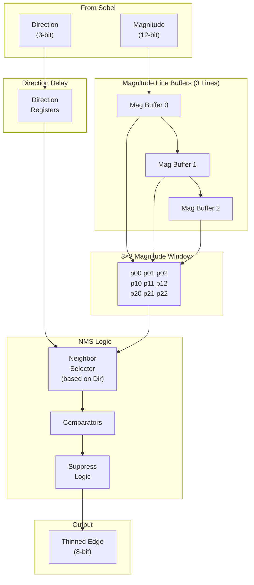

### Specifications

| Parameter      | Value          | Notes                             |
| -------------- | -------------- | --------------------------------- |
| Window Size    | 3 × 3          | Access to 8 neighbors             |
| Line Buffers   | 2 (of 1920 px) | 12-bit magnitude storage          |
| Direction Bits | 3              | 8 quantized directions            |
| Output         | 8-bit          | Preserved or suppressed magnitude |

### NMS Algorithm

For each pixel:

1. Read the 3×3 magnitude neighborhood
2. Select two neighbors along the gradient direction
3. Compare center pixel magnitude with both neighbors
4. Output center magnitude if it's the local maximum, else 0

```text
if (mag_center >= mag_neighbor1) AND (mag_center >= mag_neighbor2):
    output = mag_center
else:
    output = 0
```

### Direction-to-Neighbor Mapping

| Direction | Angle    | Neighbor 1 | Neighbor 2 |
| --------- | -------- | ---------- | ---------- |
| 0, 7      | 0°, 180° | p11-1 (W)  | p11+1 (E)  |
| 1, 2      | 45°      | p00 (NW)   | p22 (SE)   |
| 3, 4      | 90°      | p01 (N)    | p21 (S)    |
| 5, 6      | 135°     | p02 (NE)   | p20 (SW)   |

## 6. Thresholding Stage

The thresholding stage converts thinned edge magnitudes to binary edge pixels using a simple comparator.

### Architecture

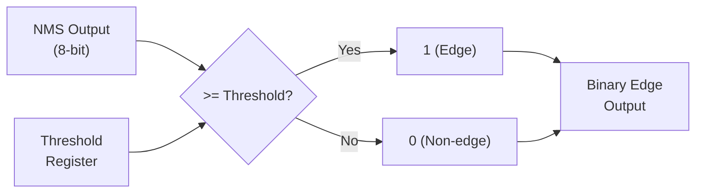

### Specifications

| Parameter     | Value          | Notes                              |
| ------------- | -------------- | ---------------------------------- |
| Threshold     | Configurable   | Software-programmable via AXI-Lite |
| Default Value | 50             | Typical value for video            |
| Input         | 8-bit unsigned | From NMS stage                     |
| Output        | 1-bit          | Binary edge map                    |

### Configuration Register

| Address | Name      | Width | Description                    |
| ------- | --------- | ----- | ------------------------------ |
| 0x00    | THRESHOLD | 8     | Edge detection threshold value |
| 0x04    | STATUS    | 8     | Pipeline status (running/idle) |

> [!TIP]
> For blob tracking applications, start with threshold = 50 and adjust based on scene lighting conditions.

## 7. Line Buffer Architecture

Line buffers are critical components that enable 2D convolution by storing previous image rows.

### Implementation

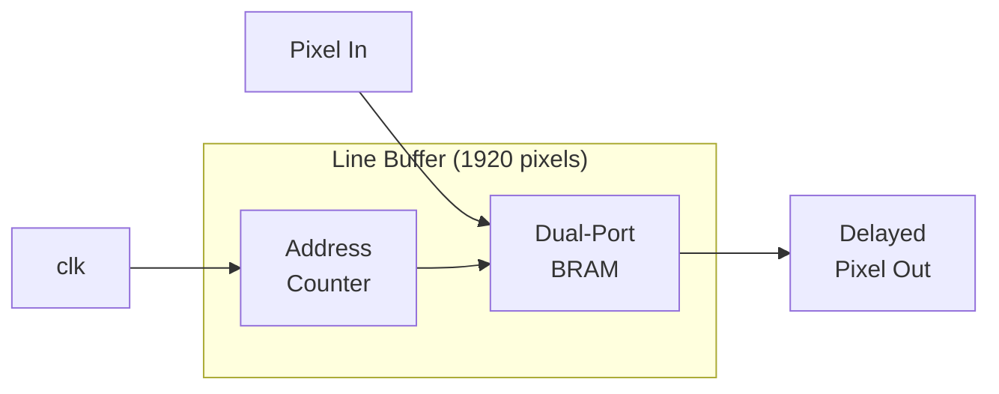

### Specifications

| Parameter      | Value       | Notes                      |
| -------------- | ----------- | -------------------------- |
| Width          | 1920 pixels | Full HD line width         |
| Implementation | BRAM        | Efficient for large depths |
| Read/Write     | Same cycle  | Dual-port configuration    |
| Latency        | 1 line      | Exactly 1920 cycles delay  |

### BRAM Usage per Stage

| Stage     | Line Buffers | Pixel Width | Total BRAM (36Kb) |
| --------- | ------------ | ----------- | ----------------- |
| Gaussian  | 4            | 8-bit       | 2                 |
| Sobel     | 2            | 8-bit       | 1                 |
| NMS       | 2            | 12-bit      | 2                 |
| **Total** |              |             | **5**             |

## 8. Resource Utilization Estimates

Projected resource usage on Xilinx XC7Z020:

| Resource    | Used   | Available | Utilization |
| ----------- | ------ | --------- | ----------- |
| DSP48E1     | 25     | 220       | 11%         |
| BRAM (36Kb) | 6      | 140       | 4%          |
| LUTs        | ~3,000 | 53,200    | ~6%         |
| FFs         | ~2,500 | 106,400   | ~2%         |

### DSP Breakdown

| Module                | DSPs   | Notes                   |
| --------------------- | ------ | ----------------------- |
| Gaussian Filter (5×5) | 25     | 25 parallel multipliers |
| Sobel (Gx + Gy)       | 0      | Adds/subs only (±1, ±2) |
| Magnitude             | 0      | Manhattan (add only)    |
| Direction             | 0      | Comparisons + shifts    |
| NMS                   | 0      | Comparators only        |
| Threshold             | 0      | Single comparator       |
| **Total**             | **25** |                         |

### BRAM Breakdown

| Module           | Size           | BRAMs (36Kb) |
| ---------------- | -------------- | ------------ |
| Gaussian Buffers | 4 × 1920 × 8b  | 2            |
| Sobel Buffers    | 2 × 1920 × 8b  | 1            |
| NMS Buffers      | 2 × 1920 × 12b | 2            |
| Config Registers | < 1 KB         | 1            |
| **Total**        |                | **6**        |

> [!NOTE]
> The design uses minimal FPGA resources, leaving significant capacity for additional processing (e.g., connected component labeling, blob tracking).

## 9. Experimental Filter Outputs

<p align="center">
  
  <br>
  <i>Figure 1: Output after applying the Gaussian Blur filter.</i>
</p>

<p align="center">
  
  <br>
  <i>Figure 2: Gradient magnitude calculated by the Sobel operator.</i>
</p>

<p align="center">
  
  <br>
  <i>Figure 3: Final edges after Non-Maximum Suppression (NMS).</i>
</p>

## 10. References

1. Canny, J. "A Computational Approach to Edge Detection." IEEE TPAMI, 1986.
2. Zynq-7000 SoC Technical Reference Manual (UG585)
3. Vivado Design Suite User Guide (UG901)
4. AXI Reference Guide (UG1037)
